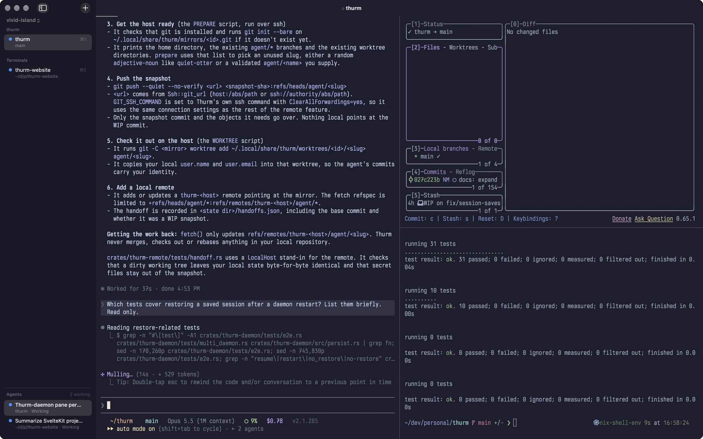
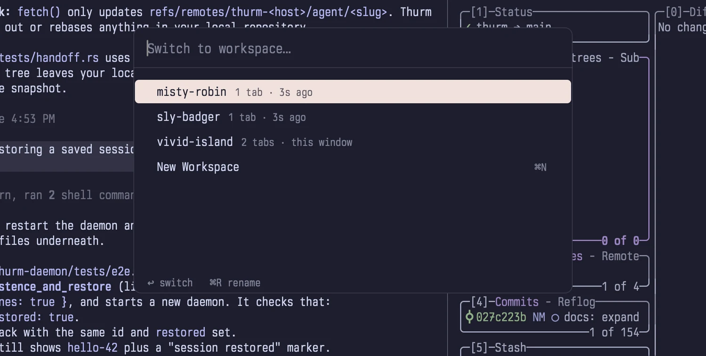
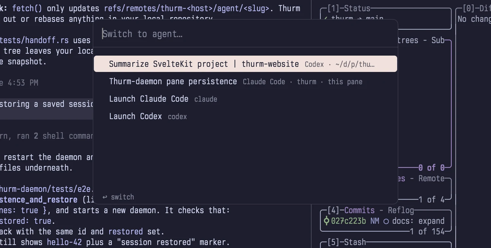
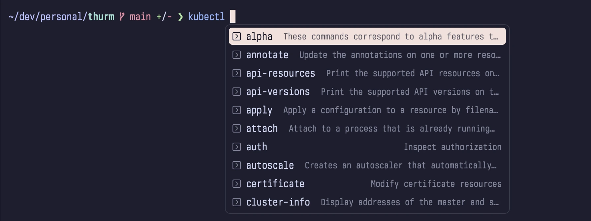
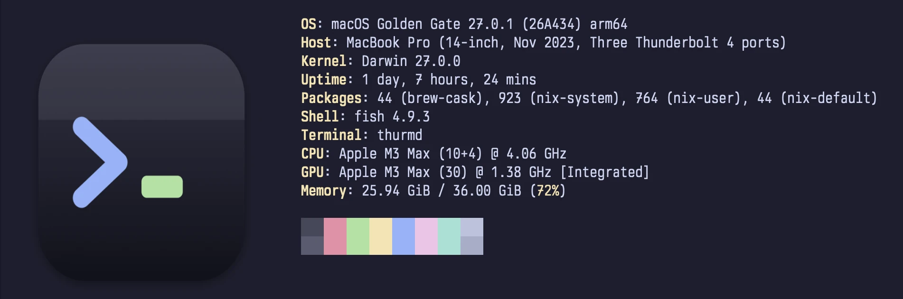
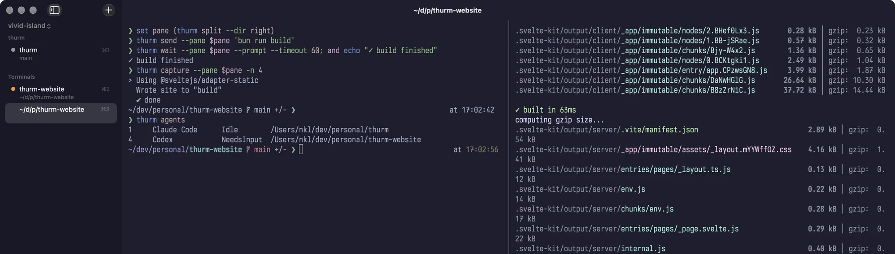

# Thurm

**A native macOS terminal for persistent sessions, coding agents, and remote work.**

Thurm brings your shells, development tools, and coding agents into one window.
Organize them with tabs, split panes, and workspaces. See which agents need input.
Keep work running after you quit the app, or run it on a remote host and return
from your Mac.

[Download for Apple silicon](https://github.com/nklmilojevic/thurm/releases/latest/download/Thurm.dmg)
· [Documentation](https://docs.thurm.rs/)
· [Releases](https://github.com/nklmilojevic/thurm/releases)

The app requires **Apple silicon and macOS 14 or later**. Remote sessions can run
on Linux x86_64, Linux aarch64, or another Apple silicon Mac.



## Why Thurm?

Development often needs more than one shell: an editor, a server, test output,
and agents that work on separate tasks. Thurm helps you keep that work organized
and return to it without rebuilding your terminal layout each time.

- **Keep sessions running.** Quit and reopen the app without stopping your shells.
- **Find the work that needs you.** Agent status and notifications show when a turn
  ends or an agent needs input.
- **Use remote machines from the same interface.** Remote tabs have the same splits,
  agent controls, and notifications as local tabs.
- **Control the terminal from scripts.** Open panes, send input, read output, and
  wait for results with the `thurm` CLI.

## Main features

### Sessions that survive an app quit

The `thurmd` daemon owns the shell processes and terminal state. The app connects
to it to display your session. With the default settings, quitting the app leaves
those processes running. Reopen Thurm to connect to them again.

Thurm also saves your layout, working directories, and scrollback to disk. This
helps you return to your work after a reboot, with an important limit:

| Action | What happens |
| --- | --- |
| Quit and reopen the app | Existing processes continue to run. |
| Close a pane | The process in that pane stops. |
| Reboot or restart the daemon | Thurm restores saved state and starts new processes. |

A saved session cannot restore the memory of a stopped process. Supported agents
can use configured resume commands to continue a saved conversation.

By default, Thurm saves a snapshot every 15 seconds and keeps up to 4,000
scrollback lines per pane on disk. Use `thurm save` to save one now.
See the [session guide](https://docs.thurm.rs/sessions/) for storage
paths, daemon controls, and restoration settings.

### Tabs, splits, and workspaces

Use workspaces to separate projects, then use tabs and splits within each
workspace. Choose native tabs or a sidebar that groups tabs by repository.
Shells in hidden workspaces continue to run.

Move between panes, resize splits, or zoom one pane with keyboard shortcuts.
The command palette gives you access to actions without a menu search.

For a shell you can reach from another app, use **Window > Quick Terminal**.
You can assign a global shortcut and choose its screen, position, and size.
Its shell keeps running while the quick terminal is hidden.



### Coding agent controls

Thurm detects supported agents and shows whether they are working or need input.
Use the agent switcher to return to an agent, or launch an installed agent from
a preset. Built-in definitions include Claude Code, Codex, Gemini CLI, Aider,
OpenCode, and others. You can add your own definitions and presets.

Claude Code and Codex hooks report turn completion and session IDs. They support
completion notifications, session titles, and commands that wait for a turn to
finish. With a known session ID and a supported agent, you can fork a conversation
into another tab or split.



Agent notifications apply to panes without focus. Claude Code permission
notifications also have **Approve** and **Deny** buttons for the active request.

Thurm uses agent tools installed on your machine. When it launches Claude Code
or Codex without Thurm hooks, it adds the hooks to that agent's configuration
by default. Set `agents.install_hooks = false` to disable this behavior.
See the [agent guide](https://docs.thurm.rs/agents/) for setup and limits.

### Remote workspaces and repository handoff

Connect to a Linux host or another Mac over SSH. Each host appears as a remote
workspace. Its processes keep running when your Mac sleeps, changes networks,
or quits Thurm. The app reconnects when the host becomes available.

Thurm uses the system SSH client and your SSH configuration. It does not require
a separate Thurm account or relay service. Agent forwarding is disabled.

You can also hand a local repository to a remote agent. Thurm sends a Git snapshot
to a separate branch and worktree on the host. The snapshot includes uncommitted
changes and untracked files, but excludes ignored files. Your local working tree,
index, and stash stay unchanged.

The agent works in that remote worktree. Thurm fetches its committed results for
you to review and merge. It does not merge them into your local branch. This lets
you continue local work while a remote agent handles another task.

See the [remote guide](https://docs.thurm.rs/remote/) for host setup,
SSH requirements, file transfers, and handoff cleanup.

### Terminal tools for daily work

The interface uses AppKit. Metal and CoreText draw text and images, and
libghostty-vt maintains terminal state.

- **Shell integration:** prompt marks, working directory tracking, and completion
  choices for zsh, bash, and fish.
- **Text and images:** font ligatures, bundled JetBrains Mono and Nerd Font symbols,
  and support for the kitty keyboard and graphics protocols.
- **Navigation:** scrollback search, prompt navigation, and Cmd+click to open URLs.
- **Appearance:** themes, automatic light and dark theme selection, font settings,
  and custom key bindings.
- **Input protection:** Secure Keyboard Entry, automatic activation when a password
  prompt is detected, and confirmation for multiline pastes outside bracketed paste mode.
- **Notifications:** alerts for agents and for commands that finish in a pane without
  focus after at least 15 seconds, by default.





### Optional on-device AI

Apple Intelligence can name agent tabs, detect unanswered questions for agents
without hooks, summarize agent notifications, and explain the last finished command.

These features are **off by default**. They require macOS 26 or later and Apple
Intelligence enabled in System Settings. Thurm runs this model on your Mac and
skips it while a password prompt is active. Each feature can be disabled separately.
These settings are separate from the coding agents you run in the terminal.

## Install and start

1. Download [Thurm.dmg](https://github.com/nklmilojevic/thurm/releases/latest/download/Thurm.dmg).
2. Open the disk image and drag **Thurm** to **Applications**.
3. Eject the disk image, then open Thurm from Applications.

To use nightly builds, download
[Thurm-tip.dmg](https://github.com/nklmilojevic/thurm/releases/download/tip/Thurm-tip.dmg)
or select **Thurm > Update Channel > Tip**. Release builds use Sparkle for updates.

Start with these shortcuts:

| Action | Shortcut |
| --- | --- |
| New tab | Cmd+T |
| New workspace | Cmd+N |
| Split right / down | Cmd+D / Cmd+Shift+D |
| Move focus between panes | Cmd+Option+Arrow |
| Zoom the current pane | Cmd+Shift+Return |
| Close pane | Cmd+W |
| Search scrollback | Cmd+F |
| Command palette | Cmd+Shift+P |
| Workspace switcher | Cmd+Shift+O |
| Agent switcher | Cmd+Shift+A |
| Open / reload configuration | Cmd+, / Cmd+Shift+, |

For CLI access, select **Thurm > Integrations > Install Command-Line Tool**.
Make sure its install directory is on your `PATH`, then run `thurm --help`.
See the [installation guide](https://docs.thurm.rs/install/) for details.

## Use Thurm from the command line

The CLI lets scripts and agents control the same panes you use in the app.
Keep Thurm open for commands that create or focus tabs and splits.

### Open a split and read its output

Run this from a Thurm shell pane:

```sh
pane=$(thurm split --dir right)
thurm wait --pane "$pane" --prompt --timeout 10
thurm send --pane "$pane" 'echo THURM_READY'
thurm wait --pane "$pane" --match '^THURM_READY$' --timeout 10
thurm capture --pane "$pane" -n 20
```

`send` adds Enter unless you pass `--no-enter`. Commands that accept an optional
`--pane` use `THURM_PANE_ID` to select the current pane. Use `thurm list` to find
other pane IDs and `thurm --json list` for structured output. A wait timeout returns
exit code 124. Waiting for a shell prompt requires shell integration.



### Launch and inspect an agent

With Codex installed, run:

```sh
thurm presets
thurm launch Codex --split right
thurm agents
thurm hooks status
```

Use a preset name from `thurm presets` to launch another installed agent.
The [CLI guide](https://docs.thurm.rs/cli/) covers agent waits, session
forks, process inspection, and other commands. The repository also includes a
[Thurm skill for coding agents](skills/thurm/SKILL.md).

### Connect a remote host

Replace `me@devbox.example.org` with your SSH target:

```sh
thurm remote add devbox me@devbox.example.org
thurm remote doctor devbox
thurm --remote devbox agents
```

The add command checks the host and offers to install Thurm there. Set up SSH key
access and accept the host key before you connect. Background connections cannot
use SSH password prompts.

To hand off the repository in your current directory, first list the host's presets.
If Claude Code is installed there, use:

```sh
thurm --remote devbox presets
thurm handoff --remote devbox --preset claude
```

Thurm opens the remote worktree in a tab. Enter the task there. Ignored files,
such as `.env` and `node_modules`, are not copied, so set up dependencies on the host.

## Configure Thurm

Thurm reads `~/.config/thurm/config.toml` by default. Use `thurm config-path` to find
the active file. All settings are optional. For example:

```toml
[font]
size = 14.0
ligatures = true

[window]
tab_style = "native"

[colors]
theme = "light:catppuccin-latte,dark:catppuccin-mocha"

[session]
quit = "detach"

[quick_terminal]
hotkey = "ctrl+grave"
position = "top"
size = 0.4
```

Run `thurm reload` after you edit the file. You can also write a setting and reload
it in one command:

```sh
thurm set font.size 14.0
thurm theme nord
```

To enable the optional Apple Intelligence features, add `[ai]` with `enabled = true`.
The [example configuration](config.example.toml) lists all settings and defaults.
See the [configuration guide](https://docs.thurm.rs/configuration/)
for more examples.

### Manage the configuration with Home Manager

The flake includes a Home Manager module. Add the flake as an input, then import
the module:

```nix
# flake.nix
inputs.thurm.url = "github:nklmilojevic/thurm";

# Home Manager configuration
imports = [ inputs.thurm.homeManagerModules.default ];

programs.thurm = {
  enable = true;
  settings = {
    font.size = 14.0;
    colors.theme = "light:catppuccin-latte,dark:catppuccin-mocha";
    keybindings."cmd+shift+d" = "split_down";
    remote = [ { name = "devbox"; host = "devbox"; } ];
  };
  themes.mine = {
    foreground = "#cdd6f4";
    background = "#1e1e2e";
    palette = [ /* 16 colors */ ];
  };
};
```

| Option | Effect |
| --- | --- |
| `settings` | Written as `~/.config/thurm/config.toml` |
| `extraConfig` | TOML text added after `settings` |
| `themes.<name>` | Written as `~/.config/thurm/themes/<name>.toml`. Use an attribute set, a file, or text. Select it with `colors.theme = "~/.config/thurm/themes/<name>.toml"` |
| `package` | The `thurm` and `thurmd` package. On macOS the default is `null` because the app includes its own CLI. On Linux the default is the flake's `thurm` |
| `reloadOnChange` | Runs `thurm reload` after a config or theme change when the daemon runs. It never starts the daemon. The default is `true` |

On macOS, use **Install Command-Line Tool** to get the CLI. A CLI from another
build might not connect to the app's daemon. On a remote host, pin the flake
input to the version of your app.

Home Manager makes the file read-only. Because of this, changes from the
settings window, `thurm set`, `thurm theme NAME`, and `thurm remote add` fail.
Make these changes in your Home Manager configuration.

## Build and contribute

To build the app, use an Apple silicon Mac with macOS 14 or later and Xcode 26 or
later. The [Nix development shell](flake.nix) provides Rust, Zig, and the other
command-line build tools.

```sh
git clone https://github.com/nklmilojevic/thurm.git
cd thurm
nix develop
./macos/build.sh
open macos/build/Thurm.app
```

Without Nix, install Rust stable with the `aarch64-apple-darwin` target and
Zig 0.16.0, then run the build script. The first build needs network access for
the pinned Ghostty source and Swift dependencies. Local builds use an ad hoc
signature by default.

Use `./macos/build.sh --install` to build, install, and open the app. It replaces
Thurm in `/Applications`, or in `~/Applications` if `/Applications` is not writable.
It also links `thurm` into `~/.local/bin` when that directory exists and the
destination is not a regular file.

The Swift app connects through a Rust FFI to the daemon. The main source areas are:

| Path | Purpose |
| --- | --- |
| `macos/` | AppKit interface, Metal rendering, and app packaging |
| `crates/thurm-daemon/` | Processes, panes, agent tracking, and saved sessions |
| `crates/thurm-term/` | Terminal state, graphics, input, and scrollback |
| `crates/thurm-remote/` | Remote hosts, SSH connections, and repository handoff |
| `crates/thurm-cli/` | The `thurm` command |
| `crates/thurm-config/` | Settings, themes, and agent definitions |
| `crates/thurm-client/`, `crates/thurm-proto/`, `crates/thurm-ffi/` | Client library, shared protocol, and Swift interface |
| `shell-integration/`, `completions/` | Shell integration and completion definitions |
| `vendor/libghostty-vt-sys/` | Bindings and build code for the pinned Ghostty source |
| `docs/` | Documentation site |

Run the Rust checks with Zig 0.16.0 on `PATH`, then the release script tests:

```sh
cargo test --workspace --locked
cargo clippy --workspace --all-targets --locked -- -D warnings
uv run --no-project python -m unittest discover -s macos/release -v
```

For documentation site changes, run `bun install --frozen-lockfile` and
`bun run build` from `docs/`. The site build checks internal links and anchors.
See the [development guide](https://docs.thurm.rs/development/) for
more detail and the [macOS guide](macos/README.md) for builds, signing, and releases.
For usage problems, see [troubleshooting](https://docs.thurm.rs/troubleshooting/).

## License

Thurm uses the [Apache License 2.0](LICENSE). It includes Ghostty's libghostty-vt,
Sparkle, themes, fonts, and Rust crates under their own licenses. The app and the Linux
tarballs ship their texts as `THIRD_PARTY_LICENSES`, generated by
[scripts/third-party-licenses.py](scripts/third-party-licenses.py).
